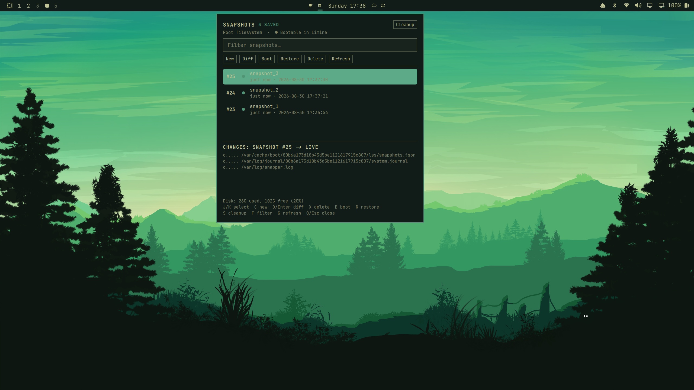
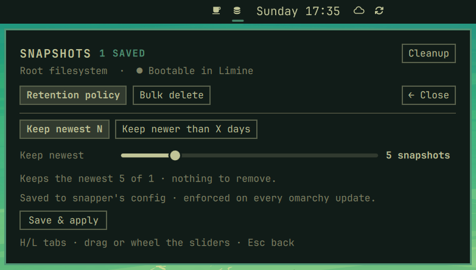

# Snapman

Snapman brings Snapper snapshot management to the Omarchy shell bar. It keeps
recovery points visible and cleanup easy to manage without requiring Snapper
commands for everyday tasks. View, diff, create, restore, boot into, and delete
snapshots from a compact, keyboard-first panel.

## Features

### Browse and inspect

A compact, filterable list of every stored snapshot with its age, used space,
and Limine bootable marker. Selecting a snapshot previews the changed paths
against the live filesystem, and `F` filters the list.



### Retention policy & bulk cleanup

Press `S`, or the header **Cleanup** button, to open the cleanup view. Set a
persistent retention policy — keep the newest N snapshots (written to snapper's
config and enforced on every `omarchy update`), or keep snapshots newer than X
days (trimmed by a daily background timer). The same view runs one-shot bulk
deletes, with a live count and a confirmation dialog before anything is removed.



### Per-snapshot actions

Create, full diff, boot next, restore, and delete any snapshot directly from
the panel, with vim bindings throughout — including `H`/`L` to switch the choice
on confirmation dialogs. A standalone TUI (`omarchy-snapman-tui`, requires `fzf`
+ `less`) is included as a bonus.

### Pinned snapshots

Pin a snapshot (`P`, or the **Pin** button) to protect it from retention
cleanup. Snapper marks it *important*, so it survives the count-based policy
and the daily age-based timer skips it. Unpin to let it age out normally.

### Update awareness

When an update is available, the panel shows a verification label and offers
**Diff** to preview the changes on GitHub and **Update** to apply the
fast-forward directly. **Store** keeps the marketplace page one click away.

## Requirements

- `snapper` with a `root` config, and your user in `ALLOW_USERS` (so deletes and
  creates run without a password — see the setup below).
- `limine-snapper-sync` for the bootable marker and boot-to-snapshot.
- `jq` (used by the retention timer).
- `omarchy-launch-floating-terminal-with-presentation` (ships with Omarchy).

Retention config writes run through `sudo` and prompt for your password once.

## Install

```sh
omarchy plugin add https://github.com/Grenco/omarchy-snapman.git --enable
```

The plugin id is `grenco.snapman`. Enable it later with
`omarchy plugin enable grenco.snapman`.

## Snapper user access (one-time, with sudo)

Snapman performs create/delete/bulk operations without a password, but snapper
only grants that to users listed in the `root` config's `ALLOW_USERS`. Omarchy
does not add this by default, so set it up once:

```sh
sudo snapper -c root create-config /          # only if /etc/snapper/configs/root is missing
sudo snapper -c root set-config ALLOW_USERS="$(whoami)"
sudo snapper -c root set-config SYNC_ACL="yes"
```

`snapperd` is D-Bus-activated and starts on demand — there is nothing to enable.
If this step is skipped, creates/deletes will prompt for your password, and the
plugin's retention installer prints a reminder pointing back here. Editing the
retention policy still prompts for sudo, because it rewrites
`/etc/snapper/configs/root`.

## Removal

```sh
omarchy plugin remove grenco.snapman
```

The retention timer and helper scripts are user-owned, so the plugin command
does not remove them. To clean those up as well:

```sh
systemctl --user disable --now snapman-retention.timer
rm -f ~/.local/bin/snapman-retention \
      ~/.local/bin/omarchy-snapman-tui \
      ~/.config/systemd/user/snapman-retention.service \
      ~/.config/systemd/user/snapman-retention.timer
rm -f ~/.config/omarchy/snapman.conf   # saved retention policy (optional)
systemctl --user daemon-reload
```

## Keys

```
J/K select   C new   D/Enter diff   X delete   B boot   R restore
S cleanup   F filter   G refresh   Q/Esc close
```

In the Cleanup view: `H`/`L` switch tabs, `Esc` or **← Close** goes back.

## Notes

- Applying age-based retention installs a small user systemd timer
  (`snapman-retention.timer`, daily at 06:00) and a helper script under
  `~/.local/bin/snapman-retention`. Count mode disables the timer.
- Policy state is kept in `~/.config/omarchy/snapman.conf`.

## License

MIT — see [LICENSE](LICENSE).
